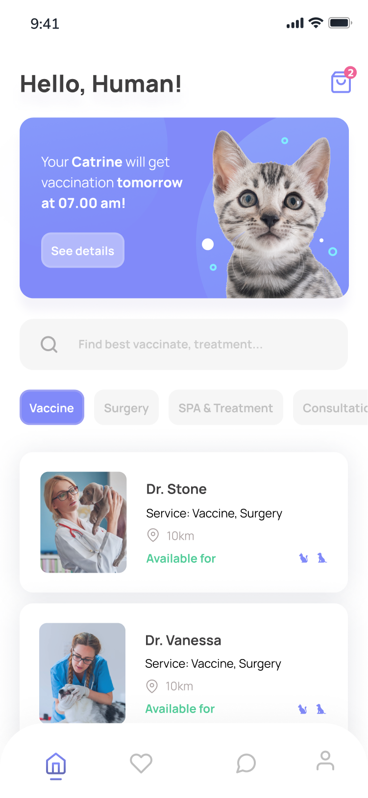

# Flutter Healthy Pet App

Hi Future Developer!

Welcome to the Flutter Healthy Pet App! 🎉

In this project, we're embarking on an exciting journey to transform a sleek Figma design into a fully functional mobile application using Flutter. This project is a key step in my Flutter learning adventure, where I'll be diving into the fundamental layouts and essential components of Flutter development.

Join me as I explore, learn, and build a beautiful and intuitive app dedicated to keeping our pets healthy and happy. Whether you're a fellow beginner or a seasoned developer, there's something here for everyone. Let's create something amazing together!

## ✨ Features
- **Stunning Design**: Enjoy a visually appealing and user-friendly interface.
- **Bottom Navigation Bar**: Seamlessly navigate through the app with a smooth bottom bar.
- **Splash Screen**: Experience a captivating splash screen that welcomes you to the app.

## 🚀 Getting Started

Follow these steps to get a local copy up and running.

#### Prerequisites:

Make sure you have Flutter installed on your machine. If not, follow the official [Flutter installation guide](https://docs.flutter.dev/get-started/install).

#### Installation

1. Clone the repo 
```sh 
git clone https://github.com/novaardiansyah/healtypet-flutter.git
```
2. Navigate to the project directory
```sh 
cd healtypet-flutter
```
3. Install dependencies
```sh
flutter pub get
```
4. Run the app
```sh
flutter run
```

## 🛠️ Built With

- [Flutter](https://flutter.dev/) - The powerful UI toolkit for building natively compiled applications for mobile, web, and desktop from a single codebase.
- [Figma](https://www.figma.com/) - A collaborative interface design tool used for designing the app's stunning and intuitive UI.

## 🌟 Sneak Peek 

Get a glimpse of the app's enchanting world by exploring the current progress at [APK Release](https://terabox.com/s/12MYYO2bG1GsBEWI4gitpWA). Feast your eyes on these snapshots that showcase the app's dynamic essence:

<div style="margin-bottom: 5px">
  
  
</div>

## 🤝 Contributing

Contributions are what make the open-source community such an amazing place to learn, inspire, and create. Any contributions you make are **greatly appreciated**.

1. Fork the Project
2. Create your Feature Branch (`git checkout -b feature/AmazingFeature`)
3. Commit your Changes (`git commit -m 'Add some AmazingFeature'`)
4. Push to the Branch (`git push origin feature/AmazingFeature`)
5. Open a Pull Request

## 🙏 Thanks to

| Contributor                  | Details                         |
|------------------------------|---------------------------------|
| [Arif Iskandar](https://www.youtube.com/@cuunoong) | Youtube channel contributions. |
|  | Design by: Software Seni |

## 📞 Let's Connect!

Need to chat? Feel free to drop me a line via [Email](mailto:novaardiansyah78@gmail.com) or hit me up on  [Whatsapp](https://wa.me/6289506668480?text=Hi%20Nova,%20I%20have%20a%20question%20about%20your%20project:%20https://github.com/novaardiansyah/healtypet-flutter/) I'm just a message away, ready to groove with you! 📩

---

Thank you for checking out our Application! We hope you enjoy using it as much as we enjoyed building it. Happy coding! 🚀


## 🚀 Project Status  


[](https://github.com/novaardiansyah/healtypet-flutter/blob/main/references.json)

[](https://github.com/novaardiansyah/healtypet-flutter/blob/main/LICENSE)
[](https://github.com/novaardiansyah/healtypet-flutter/commits/main)
